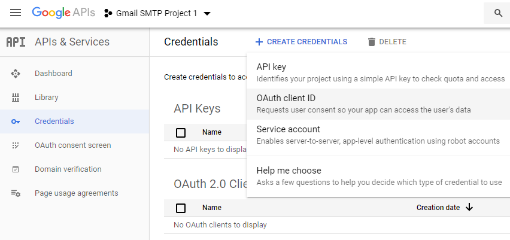

# Gmail Smtp Plugin For Wordpress

## Gmail Smtp Configuration

In order to get started with the plugin go to Settings->Gmail SMTP from your admin dashboard.

  

# Gmail SMTP Project Creation 

1. Go to console.cloud.google.com/apis/dashboard.

2. Login to your Google account which will be used to send an email.

3. Create a new project where your application will be registered.

It doesn't have to be "Gmail SMTP Project 1". You can name it whatever you like. I chose a meaningful name because I have multiple projects in it.

# Credentials/App Creation

1. Once the project is created go to Credentials > CREATE CREDENTIALS and select OAuth client ID.

2. In order to create an OAuth client ID, you need to configure the OAuth consent screen first. So click CONFIGURE CONSENT SCREEN.

3. Choose how you want to configure and register your app. Since I'm not using G
Suite I had to choose External.

4. Enter a name (e.g. Gmail SMTP) for the OAuth consent screen.
                                  |

5. You can configure optional fields such as Authorized domains, Application home page, Application privacy policy link and Application terms of service link (I was able to skip all and click SAVE AND CONTINUE). You do however need to enter an email address under the Developer contact information section.

6. Skip the Scopes screen.                                                     

7. Add a test user this should be the same email as you will authorise with (This is not required if you publish your app only if you plan to use this app in test mode).

8. Keep your app in test mode or publish it. If the Publishing status is set to In production, a warning message (This app isn't verified) may appear on the consent screen that you can easily skip.

9. Go to the Credentials tab and select OAuth client ID under **CREATE CREDENTIALS**.

                                                                     

10. Set the application type to Web application and enter a name for it (e.g. Gmail SMTP App). Copy the Authorized Redirect URL from the settings and paste it into the field here.

11. Click Create. This will generate a Client ID and Client Secret for you. Copy and paste them into the settings area of the plugin.

### Gmail SMTP Settings Configuration 

1. Configure the rest of the settings. It includes, 

**OAuth Email Address**: The email address that you will use for SMTP authentication. This should be the same email used in the Google Developers Console.

**From Email Address**: The email address which will be used as the From Address when sending an email.

**From Name**: The name which will be used as the From Name when sending an email.

**Type of Encryption**: The encryption which will be used when sending an email (either TLS/SSL). By default, it should be set to TLS since SSL has been deprecated since 1998.

**SMTP Port**: The port which will be used when sending an email. If you choose TLS
it should be set to 587. For SSL use port 465 instead.

2. Click Save Changes.

Now that you have configured the settings a Grant Permission button will appear.

3. Clicking on it will take you to a consent screen where you will be able to grant this app access to the Gmail API.

4. When you click Allow you will get redirected back to the plugin settings. You should see a message like Access Granted Successfully. The SMTP Status should also get set from Not Connected to Connected.

That's it. Gmail SMTP plugin will now be able to take control of all outgoing email from your website.

# Test Email

In order to test the email functionality, you can send a test email from the Test Email tab.

Debug option is enabled by default for the test email functionality - which means you would be able to see if the plugin was able to send the email without any error.

### Troubleshooting

By default, your SMTP port should be configured on 587 (with TLS encryption). If you can't get it to work then you can try changing it to 465 (with SSL encryption).

If you still can't get either to work try port 25 with TLS first and then SSL. Please note that most servers don't support encryption on port 25, which is why port 587 and 465 are the preferred options.

### Fresh Authorization / Removing Access From The Application

For some reason, if you ever want to stop using this plugin or do a fresh authorization this option might come in handy.

Revoke Access menu allows you to remove access from a previously authorized

First, you need to click on the account settings link. This will take you to a page where you can remove access from the Gmail SMTP application.

#### Apps Connected To Your Account

Once you have removed access from it, go back to the Remove Access tab in the plugin settings and delete the Access key.

Access key is a token that the plugin received when you first granted your app access to the Gmail API. This token is necessary to communicate with the Gmail API and send an email. In order to avoid any confusion, the plugin does not show it on the settings page.

Once you delete this token the plugin can no longer connect to the Gmail SMTP
server or send an email. This means you will need to reauthorize (using the web application link in the settings) before you can start using the plugin again. However, you won't need to set up everything from scratch as long as the project still exists in your Google Developers Console.

## Gmail Smtp Add-Ons

[Gmail SMTP plugin comes with add-ons](https://wphowto.net/gmail-smtp-plugin-for-wordpress-1341) that you can use to enhance its functionality on your website.

* Reply-To Reply-To add-on lets you set a reply-to address for all outgoing email messages.

* Cc Cc add-on lets you set a cc recipient for all outgoing email messages.
